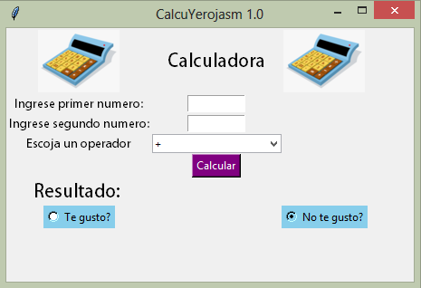
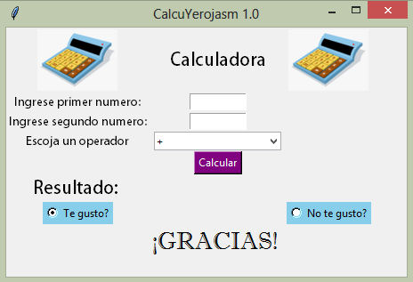

# CalcuYerojasm-1.0
**Nombre del programa:** CalcuYerojasm 1.0

**Realizado por:**
Yeison Darío Rojas Mora - 
Estudiante de Ingenieria Electronica

**Objetivo:** Programa que permite hacer operaciones matematicas basicas

**Información básica para ejecutar el programa:**

Descargar la carpeta "Codigo_Fuente_Calculadora" y abrir archivo .py, mantener los elementos de la carpeta juntos de lo contrario no se ejecutará correctamente.

**Widgets Adicionales:**

RadioButton: Para seleccionar si le ha gustado el programa CalcuYerojasm 1.0
MessageBox: En caso de que no le haya gustado, le aparecera una caja de mensaje. con un error
Label : Para darle un mensaje al usuario despues de oprimir cualquier RadioButton.
PhotoImage: Para darle una interfaz que sea atractiva.
*Utiliza unicamente la libreria tkinter y sus componentes.*

Format: 

![Aquí la descripción de la imagen por si no carga]
(https://github.com/Yeison-Rojas/CalcuYerojasm-1.0/blob/main/Imagenes%20de%20referencia/Principal.png)

Format: 

![Aquí la descripción de la imagen por si no carga]
(https://github.com/Yeison-Rojas/CalcuYerojasm-1.0/blob/main/Imagenes%20de%20referencia/Principal2.png)
